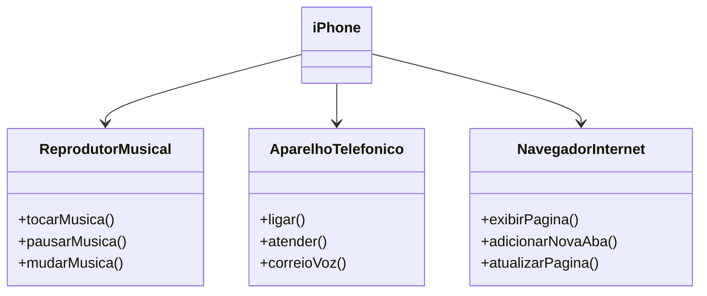

# Exemplo Diagrama UML

```mermaid
classDiagram
    class ReprodutorMusical {
        +tocarMusica()
        +pausarMusica()
        +mudarMusica()
    }

    class AparelhoTelefonico {
        +ligar()
        +atender()
        +correioVoz()
}
    class NavegadorInternet {
        +exibirPagina()
        +adicionarNovaAba()
        +atualizarPagina()
    }

    class iPhone {
    }

    iPhone --> ReprodutorMusical
    iPhone --> AparelhoTelefonico
    iPhone --> NavegadorInternet
```
